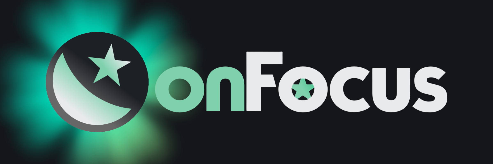
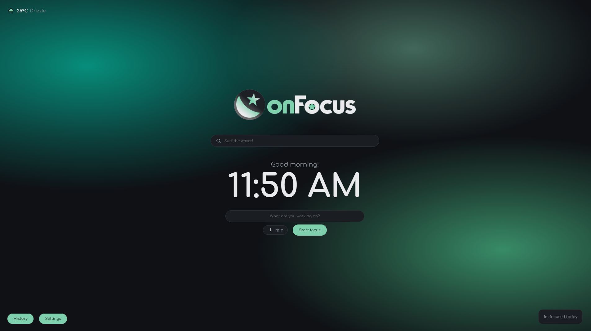
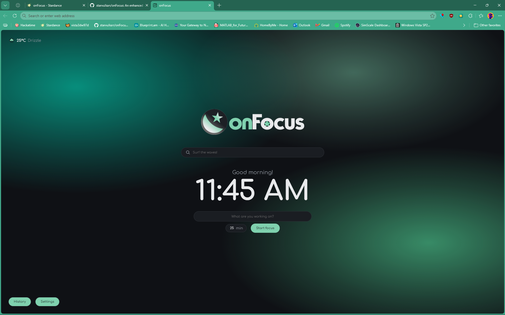
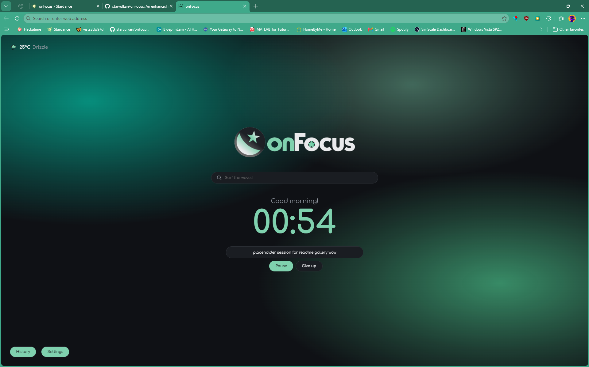
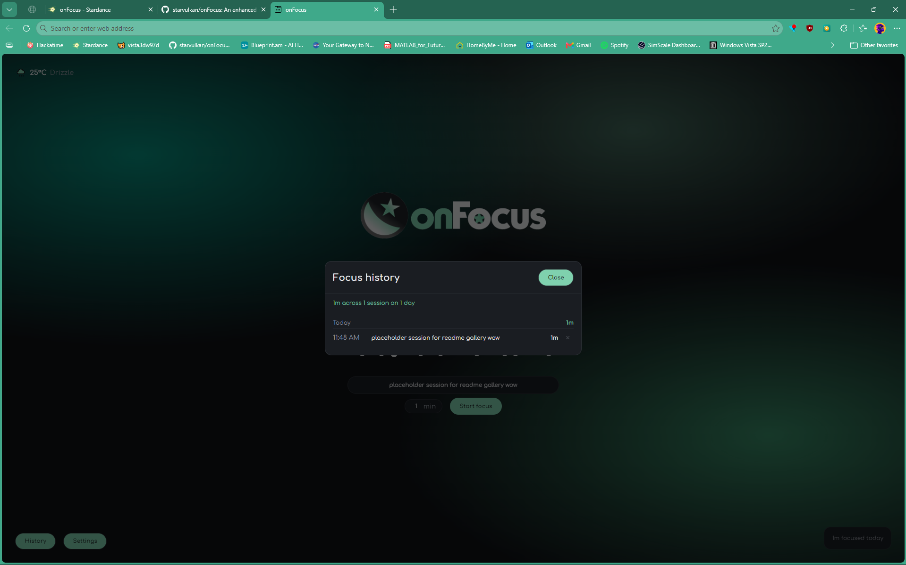
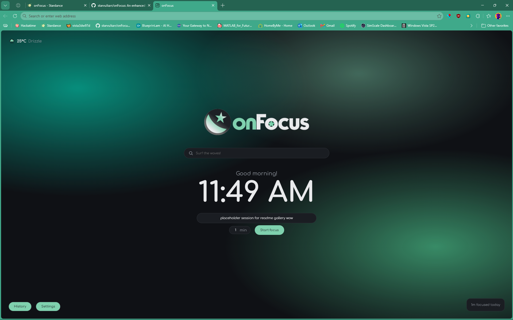
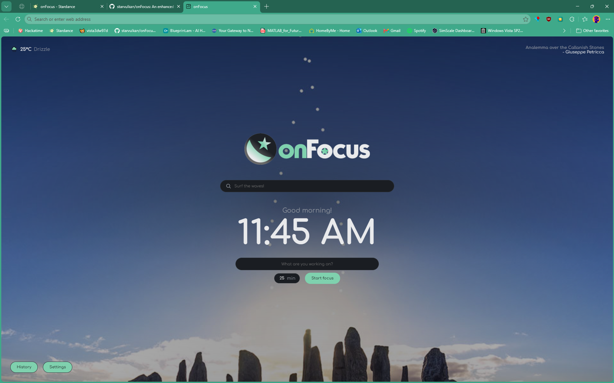
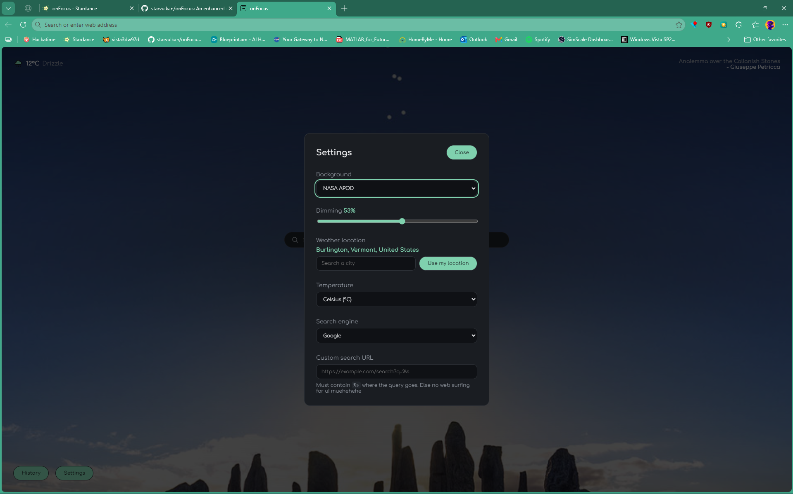

<p align="center">
    
</p>

<p align="center">
    A new tab page that keeps score of your work sessions and helps your mind get onFocus!
</p>

<p align="center">
    <a href="https://starvulkan.github.io/onFocus/"><b>Live demo →</b></a>
</p>

<p align="center">
  
</p>

## About!

Most new tab pages today are (usually) very distracting and affect our attention span by overloading us with options on what to do. onFocus aims to help you keep your mind where your work is.

Write down your focus session intent, run a timer against it, and each finished session
gets saved. This way, you can see exactly where you time goes to. 

The UI is design to be as cozy and simple as possible while also being nice to look at, to help your brain feel at ease and to focus easily. Includes the possibility to set NASA's Astronomy Picture of the Day as the wallpaper.

You can use onFocus in two ways: as a website you can open anywhere, and as a browser
extension that takes over your new tab. Up to you to choose your focusing experience!

## Photo Gallery!

|  |  |
|:--:|:--:|
|  |  |
| **Aurora**: onFocus's default wallpaper. Three aurora-looking blobs! | **A session running**: the clock becomes the countdown, and what you wrote stays under it the whole time. |
|  |  |
| **History**: every finished session, grouped by day, with what you were working on. | **Today's total**: sits quietly in the corner and only shows up once you've actually done something. |
|  |  |
| **NASA APOD**: use NASA's Astronomy Picture of the Day as your wallpaper! | **On NASA APOD mode** a dimming slider appears, because some of those photos are very bright. |

## Status!

Currently working:

- Clock and time-aware greeting
- Daily focus and a Pomodoro timer with a length you choose
- History: streaks, total time focused, every session listed
- Search bar with six engines, or any custom search URL you want
- NASA picture of the day as the background, with a dimming slider
- Settings panel
- Weather

Still to come:

- Themes and keyboard shortcuts
- Remembering more than one intent at a time

## Run it yourself!

You need Node.js 20 or newer.

```bash
npm install
cp .env.example .env   # put your own NASA key in .env
npm run dev
```

A free key takes about thirty seconds to get at [api.nasa.gov](https://api.nasa.gov/). Come on, don't be lazy!

## Install it as an extension!

```bash
npm run build
```

Then open `chrome://extensions` (or the corresponding extension menu for your Chromium-based browser), turn on **Developer
mode**, click **Load unpacked**, and pick the `dist` folder. Open a new tab and
onFocus takes over.

Built and tested in Edge, works in any Chromium-based browser.

## Licence

GPL-2.0
