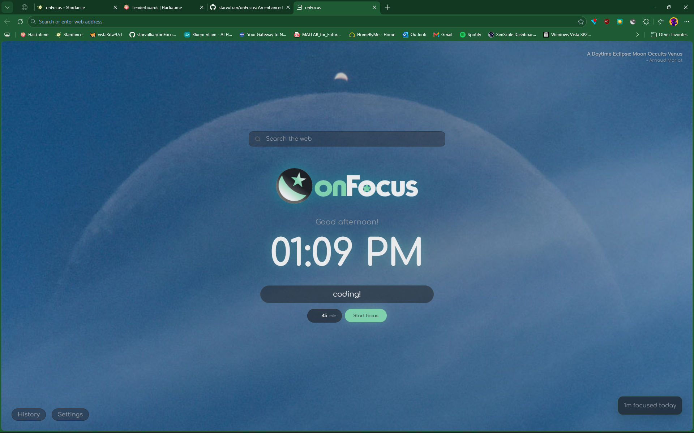
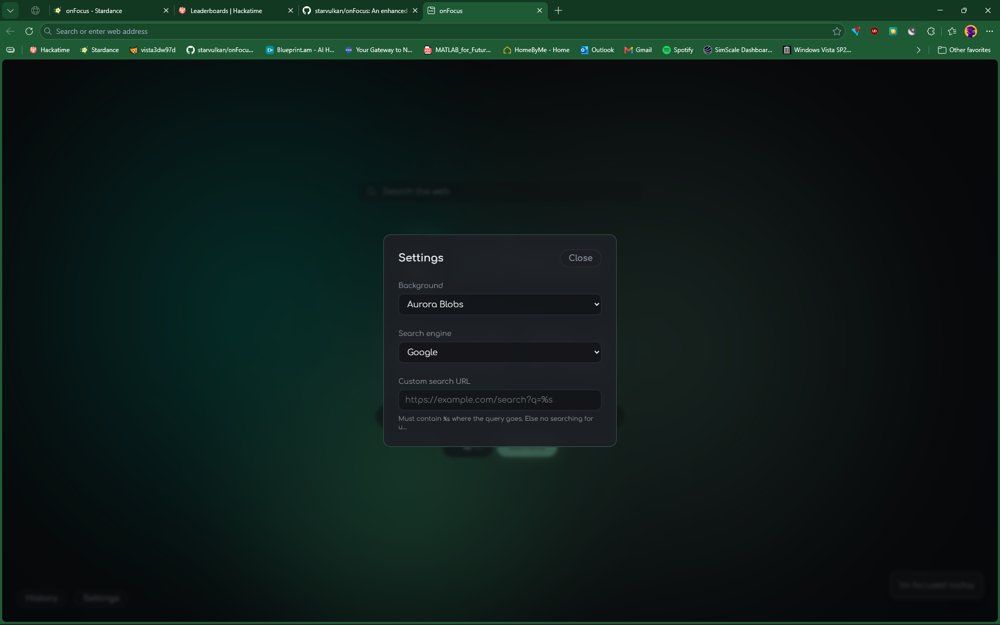

<p align="center">
    
</p>

<p align="center">
    A new tab page that keeps score of your work sessions and helps your mind get onFocus!
</p>

<p align="center">
    <a href="https://starvulkan.github.io/onFocus/"><b>Live demo →</b></a>
</p>

<p align="center">
  
</p>

## The idea

Most new tab pages are just a wall of links back to the sites
that send you on a 4-hour detour and destroy your productivity. onFocus aims to help you keep your mind where your work is.

Write down your focus, run a timer against it, and each finished session
gets saved. After a week you can see where your time actually went. You won't lose track of it as often anymore (I hope)!

It works two ways: as a website you can open anywhere, and as a browser
extension that takes over your new tab. Up to you to choose your focusing experience!

## Photo Gallery!

|  |  |
|:--:|:--:|
|  |  |
| **Aurora** — three blobs drifting on their own timings, the default background when you first open it. | **A session running** — the clock becomes the countdown, and what you wrote stays under it the whole time. |
|  |  |
| **History** — every finished session, grouped by day, with what you were working on. | **Today's total** — sits quietly in the corner and only shows up once you've actually done something. |
|  |  |
| **Settings** — pick your background and your search engine, or paste a custom search URL. | **On NASA mode** a dimming slider appears, because some of those photos are very bright. |

## Status

Working now:

- Builds and deploys on its own every time I push
- One codebase that runs as both a website and a Manifest V3 extension
- Loads unpacked in any Chromium browser and takes over the new tab
- Clock and time-aware greeting
- A saved-data layer that works in both versions
- Full visual identity: logo, palette, animated aurora background
- Daily focus and a Pomodoro timer with a length you choose
- History: streaks, total time focused, every session listed
- Search bar with six engines, or any custom search URL you want
- NASA picture of the day as the background, with a dimming slider
- Settings panel to switch all of it around

Still to come:

- Weather
- Themes and keyboard shortcuts
- Remembering more than one intent at a time

## Running it yourself

You need Node.js 20 or newer.

```bash
npm install
cp .env.example .env   # put your own NASA key in .env
npm run dev
```

A free key takes about thirty seconds to get at [api.nasa.gov](https://api.nasa.gov/). Come on, don't be lazy! If you skip it the app falls back to NASA's shared demo key, which works but runs out quickly.

## Install it as an extension

```bash
npm run build
```

Then open `chrome://extensions` (or the corresponding extension menu for your Chromium-based browser), turn on **Developer
mode**, click **Load unpacked**, and pick the `dist` folder. Open a new tab and
onFocus takes over.

Built and tested in Edge, works in any Chromium-based browser.

## Why the API key is public

Vite copies any variable starting with `VITE_` straight into the files it
builds, so the NASA key can be read in the finished site. That is true for any
app that runs in the browser; none of them can hide a secret. The `.env` file
keeps the key out of my commit history, not out of the build. NASA's free keys
have a request limit and no payment attached, so it is a safe thing to expose
here.

The deployed site doesn't carry my key at all, since `.env` never leaves my
machine. It uses the demo key instead, and because onFocus only asks NASA once
a day and caches the answer, nobody ever gets close to the limit.

## Built for Stardance

Made during [Hack Club Stardance](https://stardance.hackclub.com/).
The devlogs follow the build as it happens. Feel free to follow my adventure and (alleged) suffering! 

## Licence

GPL-2.0